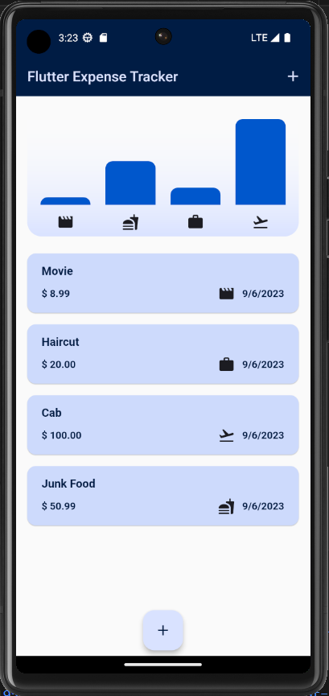
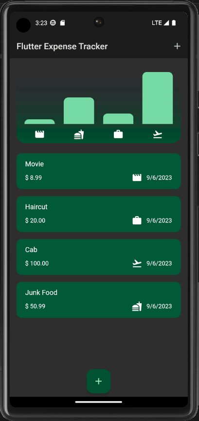
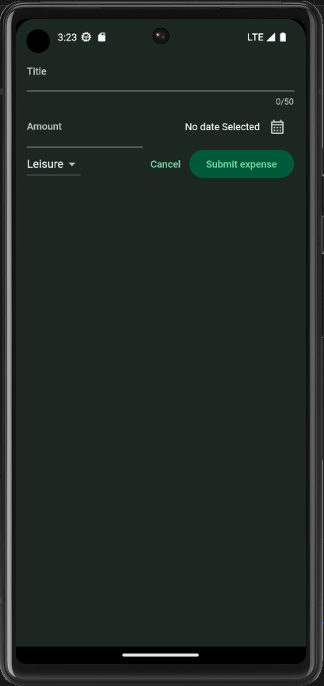
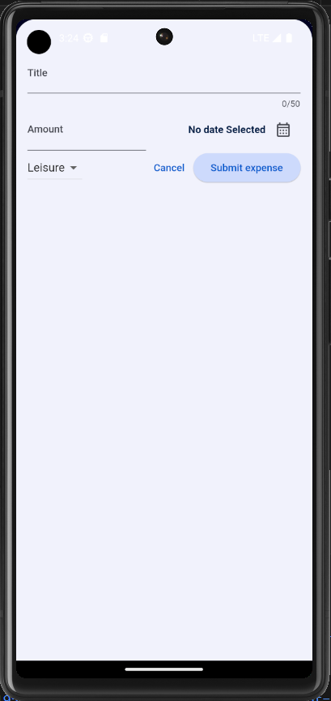

# Expense Tracker App



The Expense Tracker App is a mobile application developed using Flutter that allows users to easily track and manage their expenses. With this app, users can input their expenses and view a chart that displays their spending across four categories: food, leisure, work, and travel. The app also supports both dark and light theming to enhance the user experience.

## Features

- **Expense Input**: Users can easily input their expenses by specifying the expense category, amount, and date of expense. This information is used to categorize and display expenses in the chart and list.

- **Expense Categories**: Expenses are categorized into four domains: food, leisure, work, and travel. This categorization helps users get a clear overview of their spending habits.

- **Interactive Chart**: The app provides an interactive chart that visually represents the distribution of expenses across the four categories.

- **Expense List**: Below the chart, users can view a list of their expenses. Each expense entry displays the category, amount, and date of the expense. Users can also remove expenses from the list as needed.

- **Dark and Light Theming**: The app supports both dark and light theming to cater to users' preferences and provide a visually pleasing experience.

## Screenshots

  

 

## Getting Started

To get started with the Expense Tracker App, follow these steps:

1. **Clone the Repository**: Clone this repository to your local machine using the following command:

```bash
git clone https://github.com/dhruvrjain/expense_tracker.git
```

2. **Install Dependencies**: Navigate to the project directory and install the required dependencies using Flutter's package manager:

```bash
cd expense_tracker
flutter pub get
```

3. **Run the App**: Start the app on an emulator or physical device by running the following command:

```bash
flutter run
```

## Contributions

Contributions to the Expense Tracker App are welcome! If you have ideas for improvements, bug fixes, or new features, please feel free to open an issue or submit a pull request.

## License

This project is licensed under the MIT License

## Contact

If you have any questions or need further assistance, please don't hesitate to contact us:

We hope you find the Expense Tracker App useful and enjoy managing your expenses with it!
